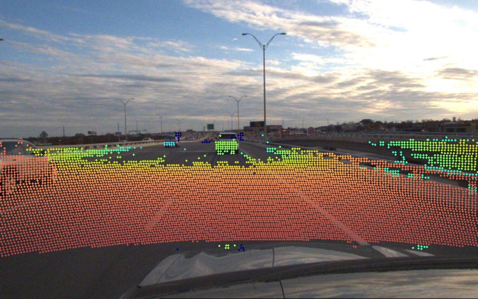

# calibration-tools

This repository provides tools to calibrate the cameras and LiDAR on the EcoCAR vehicle. The tools are designed to be used with the CACC dataset, but can be modified to work with other datasets. After following the following tutorial, you should be able to produce LiDAR camera visualizations like below.



## Sampling Images

To sample images from a dataset, use the `sample.py` script. The script will sample images from the dataset and save them to a new directory. After doing this, you can directly load these images and point clouds to matlab for calibration.

```bash
python matlab/sample.py -i /robodata/ecocar_logs/processed/CACCDataset -s 44 -o ./sample_outputs -r 10
```

## Stereo Camera Calibration

Use the MATLAB stereo camera calibrator app to calibrate the stereo cameras, save the stereo calibration data to a .mat file

```bash
cam0_params = stereoParams.CameraParameters1;
save("calib_cam0.mat", "cam0_params")
cam1_params = stereoParams.CameraParameters2;
save("calib_cam1.mat", "cam1_params")
save("calib_cam0_cam1.mat", "stereoParams", "estimationErrors")
```

```bash
raddist = cam0_params.Intrinsics.RadialDistortion;
tandist = cam0_params.Intrinsics.TangentialDistortion;
K = cam0_params.Intrinsics.K;
save("K_cam0.mat", "K", "raddist", "tandist")

raddist = cam1_params.Intrinsics.RadialDistortion;
tandist = cam1_params.Intrinsics.TangentialDistortion;
K = cam1_params.Intrinsics.K;
save("K_cam1.mat", "K", "raddist", "tandist")

A = stereoParams.PoseCamera2.A;
save("T_cam0_cam1.mat", "A")
```

## Fisheye Camera Calibration (Fisheye Model)

Then, use the custom OpenCV fisheye calibration script to calibrate the fisheye camera and save the fisheye calibration to a .yaml file.

Fisheye Camera 1
```bash
python opencv/calibrateFisheye.py -i {input_directory} -o {output_directory} -c cam2 -s 44,45
```

Fisheye Camera 2
```bash
python opencv/calibrateFisheye.py -i {input_directory} -o {output_directory} -c cam3 -s 44,45
```

Fisheye Camera 3
```bash
python opencv/calibrateFisheye.py -i {input_directory} -o {output_directory} -c cam4 -s 44,45
```


## LiDAR Camera Calibration

We will use the MATLAB LiDAR camera calibrator app to calibrate the LiDAR to the camera. Before doing this, we need to first 
undistort the fisheye images because the LIDAR camera calibrator app does not support fisheye distortion. 

```bash
python opencv/undistortFisheye.py -i {input_directory} -o {output_directory} -c cam2 -s 44
python opencv/undistortFisheye.py -i {input_directory} -o {output_directory} -c cam3 -s 44
python opencv/undistortFisheye.py -i {input_directory} -o {output_directory} -c cam4 -s 44
```

After undistorting the images, load the undistorted images and point clouds to the LiDAR camera calibration app. Follow the 
[tutorial](https://www.mathworks.com/help/lidar/ref/lidarcameracalibrator-app.html) to use the app. When finished, run the 
respective commands in the matlab command line to save each extrinsic calibration.

LiDAR Stereo camera 0
```bash
A = tform.A
save("T_os1_cam0.mat", "A", "errors")
```

LiDAR Fisheye camera 2
```bash
A = tform.A
save("T_os1_cam2.mat", "A", "errors")
```

LiDAR Fisheye camera 3
```bash
A = tform.A
save("T_os1_cam3.mat", "A", "errors")
```

LiDAR Fisheye camera 4
```bash
A = tform.A
save("T_os1_cam4.mat", "A", "errors")
```

## Postprocess to ROS Compatible Format

Use the `postprocess.py` script to convert the calibration data to a ROS compatible format. The script will save the calibration data to a .yaml file.
Copy the calibrations to the root directory where your data is stored.

```bash
python matlab/convert.py -i {matlab_dir} -s 44 -o {output_dir/calibrations}
```

## Visualize calibration quality

Use the `visualize.py` script to visualize the LiDAR to camera projection.

```bash
python visualize.py -i {input_directory} -s {sequence} -c {camid} -f {frame}
```

# Deprecated Functionality (DO NOT USE)

## Fisheye camera Calibration (Pinhole Model)

Then, use the MATLAB camera calibrator app to calibrate the fisheye camera, save the fisheye calibration data to a .mat file.

Fisheye Camera 2
```bash
cam2_params = cameraParams;
save("calib_cam2.mat", "cameraParams")
raddist = cam2_params.Intrinsics.RadialDistortion;
tandist = cam2_params.Intrinsics.TangentialDistortion;
K = cam2_params.Intrinsics.K;
save("K_cam2.mat", "K", "raddist", "tandist")
```

Fisheye Camera 3
```bash
cam3_params = cameraParams;
save("calib_cam3.mat", "cam3_params")
raddist = cam3_params.Intrinsics.RadialDistortion;
tandist = cam3_params.Intrinsics.TangentialDistortion;
K = cam3_params.Intrinsics.K;
save("K_cam3.mat", "K", "raddist", "tandist")
```

Fisheye Camera 4
```bash
cam4_params = cameraParams;
save("calib_cam4.mat", "cam4_params")
raddist = cam4_params.Intrinsics.RadialDistortion;
tandist = cam4_params.Intrinsics.TangentialDistortion;
K = cam4_params.Intrinsics.K;
save("K_cam4.mat", "K", "raddist", "tandist")
```
